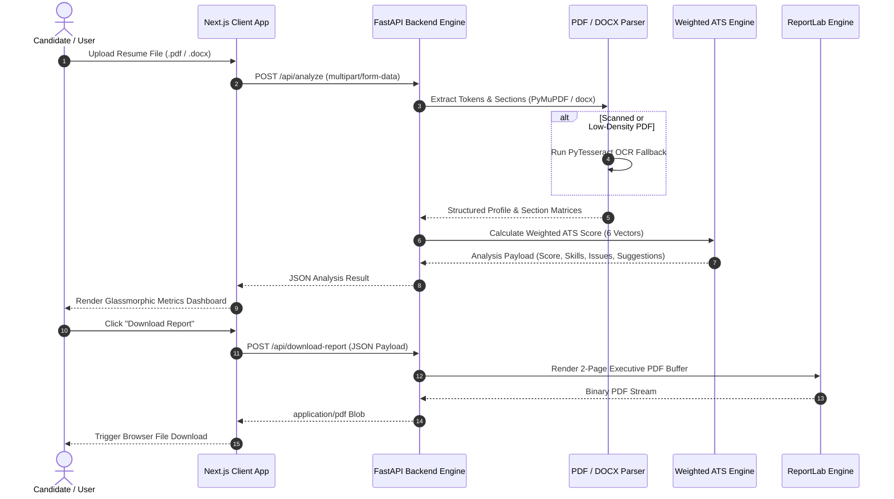

# 🎯 NexGenCV AI

### *AI-Powered Resume Intelligence Platform*

[](https://github.com/Dhavalll18/NexGenCV-AI)
[](https://nextjs.org/)
[](https://fastapi.tiangolo.com/)
[](https://python.org)
[](https://www.typescriptlang.org/)
[](https://nexgencv-ai.vercel.app)
[](LICENSE)

---

## 📌 Overview

**NexGenCV AI** is a privacy-first, enterprise-grade resume intelligence platform designed to evaluate Applicant Tracking System (ATS) compatibility, extract technical skill matrices, identify career skill gaps, and provide actionable optimization insights for job seekers and software engineers.

Unlike traditional keyword scrapers, NexGenCV AI utilizes a multi-vector weighted scoring engine, local document parsing heuristics (PDF/DOCX), intelligent OCR fallbacks, and automated executive PDF report generation.

🌐 **Live Demo**: [https://nexgencv-ai.vercel.app](https://nexgencv-ai.vercel.app)  
💻 **GitHub Repository**: [https://github.com/Dhavalll18/NexGenCV-AI](https://github.com/Dhavalll18/NexGenCV-AI)

---

## ✨ Features

- **📄 Document Intake**: Drag-and-drop support for `.pdf` and `.docx` formats up to 5MB with strict memory sanitization.
- **📊 6-Vector ATS Scoring Engine**: Evaluates resume compatibility across 6 key metrics:
  - *Keyword Density & Match Ratio (20%)*
  - *Section Completeness (20%)*
  - *Skill Coverage & Taxonomy Depth (20%)*
  - *Formatting & Parsing Integrity (15%)*
  - *Experience Action Verbs & Metrics (15%)*
  - *Project Portfolio Assessment (10%)*
- **🧠 Multi-Category Skill Matrix**: Categorizes extracted credentials into *Languages*, *Frameworks*, *Tools & Cloud*, *Databases*, and *Soft Skills*.
- **🎯 Skill Gap Detection**: Automatically detects missing, high-demand industry skills based on candidate career target domain (Software Engineering, Data Science, DevOps, Full-Stack, etc.).
- **💡 Actionable AI Recommendations**: Delivers direct candidate feedback to resolve formatting errors, missing contact details, and weak bullet points.
- **🔍 Smart Local OCR Fallback**: Automatically invokes PyTesseract OCR if standard text extraction detects scanned images or non-standard fonts.
- **📑 Executive PDF Intelligence Export**: Client-side single-click download of a clean 2-page PDF summary generated dynamically via ReportLab.
- **🎨 Glassmorphic Dark UI**: High-contrast, responsive user experience optimized for desktop and mobile devices.

---

## 🖼️ Screenshots

<div align="center">

### Home Landing Page


### Upload Zone & Dashboard Preview
| **Upload File Intake** | **Results Analytics Dashboard** |
| :---: | :---: |
| *(Drag & Drop PDF/DOCX Zone)* | *(Radial ATS Gauge & Skill Matrix)* |

### PDF Executive Summary Report
| **Generated Report (Page 1)** | **Generated Report (Page 2)** |
| :---: | :---: |
| *(Candidate Info & Sub-Scores)* | *(Missing Skills & Action Roadmap)* |

</div>

---

## 🛠️ Tech Stack

### Frontend
- **Framework**: Next.js 14 (App Router)
- **Language**: TypeScript
- **Styling**: Vanilla CSS Modules & Tailwind CSS (Dark Mode & Glassmorphism Tokens)
- **Icons**: Lucide React

### Backend
- **Framework**: FastAPI (Python 3.11)
- **Parsers**: `PyMuPDF` (`fitz`), `pypdf`, `python-docx`
- **OCR Service**: `pytesseract` + `pdf2image`
- **PDF Engine**: `ReportLab` (Dynamic 2-page Canvas Engine)
- **Validation**: Pydantic v2

### Architecture & Storage
- **Data Persistence**: 100% In-Memory Processing (Zero Database logging for strict candidate privacy)
- **Frontend Hosting**: Vercel Edge Network (`https://nexgencv-ai.vercel.app`)
- **Backend Hosting**: Render Cloud Infrastructure (`Render Blueprint`)

---

## 🏗️ Architecture Overview



---

## 📁 Folder Structure

```
NexGenCV-AI/
├── render.yaml                      # Root Render Blueprint Configuration
├── README.md                        # Master Project Documentation
├── backend/
│   ├── render.yaml                  # Backend Render Deployment Config
│   ├── requirements.txt             # Python Backend Dependencies
│   └── app/
│       ├── __init__.py
│       ├── main.py                  # FastAPI Entrypoint & CORS Config
│       ├── models/
│       │   └── schemas.py           # Pydantic Response & Input Models
│       └── services/
│           ├── resume_parser.py     # Document Text & Metadata Extractor
│           ├── skill_extractor.py   # Skill Taxonomy & Gap Analyzer
│           ├── domain_classifier.py # ML-Heuristic Career Field Classifier
│           ├── ats_scorer.py        # 6-Vector ATS Scoring Logic
│           ├── ocr_service.py       # PyTesseract OCR Fallback Engine
│           └── report_generator.py  # ReportLab PDF Generation Service
│
└── frontend/
    ├── next.config.js               # API Rewrites & Next.js Configurations
    ├── tailwind.config.js           # Theme Tokens & Accent Configurations
    ├── package.json                 # Frontend Dependencies
    ├── public/                      # SVG Logos, Favicons, & Social Cards
    └── src/
        ├── app/
        │   ├── globals.css          # Glassmorphism & Custom Dark Tokens
        │   ├── layout.tsx           # SEO Metadata & Root HTML Layout
        │   └── page.tsx             # Main SaaS Application View
        ├── components/
        │   ├── Header.tsx           # macOS-Inspired Glass Navigation
        │   ├── Logo.tsx             # Circuit Vector Monogram Logo
        │   ├── Hero.tsx             # Hero Banner & Headline Component
        │   ├── UploadSection.tsx    # Drag-and-Drop Intake Dropzone
        │   ├── ResultsDashboard.tsx # Metrics & Breakdown Grid Container
        │   ├── Footer.tsx           # Dark Minimalist Footer
        │   └── results/             # Breakdown Cards & Gauge Components
        ├── services/
        │   └── api.ts               # Fetch Client API Wrapper
        └── types/
            └── index.ts             # TypeScript Interfaces
```

---

## ⚙️ Installation Guide

### Prerequisites
- **Node.js**: v18.0.0 or higher
- **Python**: v3.11.0 or higher
- **Git**: Installed on system

---

### 1. Environment Variables Setup

Create a `.env.local` file inside the `frontend/` directory if connecting to a custom backend URL:

```env
# frontend/.env.local
NEXT_PUBLIC_API_URL=http://localhost:8000
```

---

### 2. Backend Setup

```bash
# Clone the repository
git clone https://github.com/Dhavalll18/NexGenCV-AI.git
cd NexGenCV-AI/backend

# Create a virtual environment
python -m venv .venv

# Activate virtual environment
# Windows (PowerShell):
.venv\Scripts\Activate.ps1
# macOS / Linux:
source .venv/bin/activate

# Install dependencies
pip install -r requirements.txt

# Start FastAPI development server
uvicorn app.main:app --reload --port 8000
```
Backend API will be live at `http://localhost:8000`.

---

### 3. Frontend Setup

```bash
# Open a new terminal session
cd NexGenCV-AI/frontend

# Install dependencies
npm install

# Start Next.js development server
npm run dev
```
Open `http://localhost:3000` in your web browser.

---

## 📡 API Overview

### 1. Analyze Resume
- **Endpoint**: `POST /api/analyze`
- **Content-Type**: `multipart/form-data`
- **Parameters**: `file` (`.pdf` or `.docx` file, max 5MB)
- **Response**: `200 OK`

```json
{
  "ats_score": 87,
  "category": "Excellent",
  "candidate": {
    "name": "Zala Dhaval",
    "email": "zaladhaval1818@gmail.com",
    "phone": "8140843303",
    "location": "Gandhinagar, India",
    "linkedin": "linkedin.com/in/zaladhaval",
    "github": "github.com/Dhavalll18"
  },
  "domain": {
    "primary": "Software / IT",
    "confidence": 0.85
  },
  "skills": {
    "total_count": 14,
    "programming_languages": ["Python", "JavaScript", "C++"],
    "frameworks": ["FastAPI", "React", "Next.js", "Express.js"],
    "tools": ["Git", "Docker", "Postman"],
    "databases": ["MongoDB", "PostgreSQL"],
    "missing_skills": ["TypeScript", "AWS", "Kubernetes"]
  },
  "score_breakdown": {
    "keyword_relevance": 85,
    "section_completeness": 90,
    "formatting_score": 95,
    "skill_relevance": 90,
    "experience_clarity": 80,
    "project_impact": 85
  }
}
```

### 2. Download PDF Report
- **Endpoint**: `POST /api/download-report`
- **Content-Type**: `application/json`
- **Body**: Analysis JSON Payload
- **Response**: `200 OK` (`application/pdf` binary stream)

### 3. Health Check
- **Endpoint**: `GET /health`
- **Response**: `{"status": "healthy", "service": "NexGenCV AI Engine"}`

---

## 🚀 Deployment Guide

### Frontend Deployment (Vercel)
1. Import repository `Dhavalll18/NexGenCV-AI` into Vercel.
2. Set Root Directory to `frontend`.
3. Set Environment Variable `BACKEND_URL` to your live Render backend URL.
4. Click **Deploy**.

### Backend Deployment (Render)
1. Import repository `Dhavalll18/NexGenCV-AI` into Render.
2. Select **Blueprint** deployment.
3. Render detects `render.yaml` automatically and provisions the Python environment.

---

## 🛣️ Future Roadmap

- [ ] **Job Description Matching**: Paste JD text to compute direct candidate-to-role match percentages.
- [ ] **AI Bullet Point Optimizer**: Automated rewriting of resume bullet points to quantify impact using STAR methodology.
- [ ] **Side-by-Side Comparison**: Compare multiple resume versions to track ATS score improvements over time.
- [ ] **Recruiter Batch Portal**: Bulk upload for hiring managers to rank 50+ resumes simultaneously.

---

## 🤝 Contributing

Contributions are welcome! Please follow these steps:

1. **Fork** the repository (`https://github.com/Dhavalll18/NexGenCV-AI/fork`).
2. Create your Feature Branch (`git checkout -b feature/AmazingFeature`).
3. Commit your changes (`git commit -m 'Add some AmazingFeature'`).
4. Push to the Branch (`git push origin feature/AmazingFeature`).
5. Open a **Pull Request**.

---

## 📜 License

This project is licensed under the MIT License — see the [LICENSE](LICENSE) file for details.

---

## 👤 Author

**Dhaval Zala**
- **GitHub**: [@Dhavalll18](https://github.com/Dhavalll18)
- **Live Platform**: [https://nexgencv-ai.vercel.app](https://nexgencv-ai.vercel.app)
